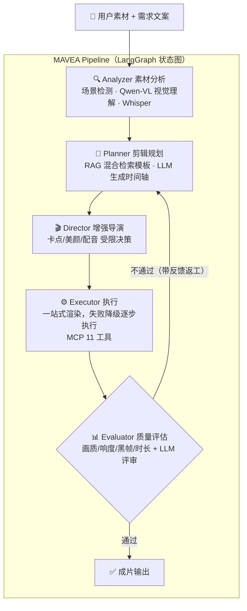

# MAVEA · Multi-Agent Video Editing Assistant

<div align="center">

**多 Agent 智能视频剪辑助手**

上传商品图片/视频片段 + 一句需求，AI Agent 自动完成 **素材分析 → 脚本规划 → 剪辑执行 → 质量评估** 全流程，输出可直接发布的带货短视频。

[](https://python.org)
[](LICENSE)
[](https://modelcontextprotocol.io)
[](https://github.com/langchain-ai/langgraph)

</div>

## 核心特性

- **4 阶段 Agent 流水线**：素材分析 → 剪辑规划 → 工具执行 → 质量评估，LangGraph 状态图编排；评估不通过自动带着反馈返工（最多 3 轮），并根据历轮分数收敛情况自适应提前停止
- **Planner 内嵌「增强导演」**：在卡点/美颜/AI 配音的白名单工具池内做受限自主决策（等价单次 function-calling），任何失败都回退默认，不阻断主流程
- **多模型可混用**：视觉理解走 Qwen-VL / GPT-4o，文本规划可走 DeepSeek / Qwen / OpenAI，不同 Agent 各用最合适的模型（详见[配置章节](#3-配置-api-key支持多模型混用)）
- **MCP v2 工具服务**：11 个视频处理工具通过 MCP Server 暴露，支持 stdio（Claude Desktop/Cursor）和 streamable-http 双传输；Agent 内部走 in-process transport 复用完整协议校验，无跨进程开销
- **RAG 剪辑模板检索**：Chroma 向量 + BM25 关键词混合检索 + BGE Reranker 重排序，根据需求匹配最佳剪辑模板
- **无参考质量评估**：模糊度/黑帧/响度爆音/时长偏差等硬指标程序化检测 + LLM-as-Judge 评审「方案-需求」匹配度
- **LLM 可靠性护栏**：素材强制全覆盖、目标时长锁定、BGM 兜底、卖点大字卡等确定性后处理，防止模型漏素材、时长漂移或成片无声
- **三种使用方式**：Gradio WebUI / FastAPI / 命令行

## 架构



- 蓝色节点为 Agent，Director 是 Planner 内的受限子决策（非独立节点）
- 返工最多 3 轮；若分数已收敛则提前停止，节省 token

## 快速开始

### 1. 环境要求

- Python 3.10+（推荐 3.12）
- FFmpeg（`ffmpeg` 和 `ffprobe` 在 PATH 中）
- 至少一个 LLM API Key（视觉理解需要 Qwen 或 OpenAI 的 Key，[申请见下](#api-key-申请地址)）

### 2. 安装

```bash
git clone https://github.com/sus96299-rgb/mavea.git
cd mavea
pip install -e .

# 复制环境变量模板
copy .env.example .env        # Windows
# cp .env.example .env       # macOS / Linux
```

### 3. 配置 API Key（支持多模型混用）

MAVEA 的模型调用按用途分两类，**可以分别配置、跨厂商混用**：

| 用途 | 对应 Agent | 模型选择规则 |
|---|---|---|
| **视觉理解**（看图、分析画面） | Analyzer | 自动选择：填了 Qwen Key 就用 Qwen-VL，否则降级用 OpenAI GPT-4o |
| **文本推理**（规划、导演决策、质量评审） | Planner / Director / Evaluator | 由 `PROVIDER` 指定：`deepseek` / `qwen` / `openai` 三选一 |

编辑 `.env`，从下面三种典型方案里选一种：

**方案 A：最省钱（推荐）** —— DeepSeek 做文本推理（几块钱用很久）+ 通义千问做视觉（新用户有免费额度）

```env
MAVEA_LLM__PROVIDER=deepseek
MAVEA_LLM__DEEPSEEK_API_KEY=sk-你的deepseek密钥
MAVEA_LLM__DEEPSEEK_MODEL=deepseek-chat

MAVEA_LLM__QWEN_API_KEY=sk-你的通义千问密钥
MAVEA_LLM__QWEN_VL_MODEL=qwen-vl-max
```

**方案 B：纯阿里，一个 Key 全包**

```env
MAVEA_LLM__PROVIDER=qwen
MAVEA_LLM__QWEN_API_KEY=sk-你的通义千问密钥
MAVEA_LLM__QWEN_MODEL=qwen-plus
MAVEA_LLM__QWEN_VL_MODEL=qwen-vl-max
```

**方案 C：OpenAI 或任意 OpenAI 兼容接口**（可接硅基流动等第三方中转；视觉仍建议配 Qwen Key）

```env
MAVEA_LLM__PROVIDER=openai
MAVEA_LLM__OPENAI_API_KEY=sk-你的密钥
MAVEA_LLM__OPENAI_MODEL=gpt-4o-mini
MAVEA_LLM__OPENAI_BASE_URL=https://api.openai.com/v1
# 接中转时改成中转地址，例如 https://api.siliconflow.cn/v1

MAVEA_LLM__QWEN_API_KEY=sk-你的通义千问密钥
```

> 🔒 **密钥安全**：API Key 只填在本地 `.env` 中，该文件已被 `.gitignore` 排除，永远不会被提交。仓库里的 `.env.example` 是空模板，别人 clone 后需要申请自己的 Key。

#### API Key 申请地址

| 厂商 | 地址 | 说明 |
|---|---|---|
| 通义千问（视觉必需） | https://dashscope.console.aliyun.com/apiKey | 新用户有免费额度，支持图片理解 |
| DeepSeek（文本推荐） | https://platform.deepseek.com/api_keys | 价格极低，适合规划/评审 |
| OpenAI | https://platform.openai.com/api-keys | GPT-4o 可同时做文本和视觉 |

### 4. 启动

**WebUI（推荐）**：
```bash
mavea-web
# 浏览器打开 http://127.0.0.1:7860
```
Windows 用户也可双击项目根目录的 `start.bat` 一键启动。

**命令行**：
```bash
mavea --video product.mp4 --prompt "做一个30秒运动鞋带货短视频，前3秒展示上脚效果"
mavea --image p1.jpg p2.jpg p3.jpg p4.jpg p5.jpg --prompt "5张图做10秒带货短视频，突出四大卖点"
```

**MCP Server（接入 Claude Desktop / Cursor）**：
```bash
mavea-mcp                      # stdio 模式
mavea-mcp --transport http     # streamable-http 模式，端口 8765
```

Claude Desktop 配置示例（`claude_desktop_config.json`）：
```json
{
  "mcpServers": {
    "mavea": { "command": "mavea-mcp", "args": [] }
  }
}
```

## MCP 工具清单

| 工具 | 功能 |
|------|------|
| `get_video_info` | 获取视频元信息（分辨率/帧率/时长/编码/音轨） |
| `cut_clip` | 裁剪视频片段 |
| `concat_videos` | 拼接视频（支持 fade/dissolve/wipe/zoom/slide 转场） |
| `add_subtitle` | 烧录 SRT 字幕 |
| `add_text_overlay` | 添加卖点大字卡（7 种位置 + 半透明底条） |
| `add_bgm` | 添加背景音乐（混音保留人声/替换，自动卡点） |
| `image_to_video` | 图片转视频（Ken Burns 推拉摇移） |
| `extract_audio` | 提取音频（wav/mp3/aac） |
| `transcribe_audio` | Whisper 语音转文字 |
| `detect_scenes` | PySceneDetect 镜头边界检测 |
| `create_video_from_timeline` | 一站式时间轴渲染（转场+字卡+配乐） |

## 技术栈

| 组件 | 技术 |
|------|------|
| Agent 编排 | LangGraph 1.x（状态图 + 条件边迭代） |
| MCP 协议 | MCP Python SDK 2.1（stdio / streamable-http 双传输） |
| 文本 LLM | DeepSeek / Qwen / OpenAI（OpenAI 兼容接口统一抽象，可混用） |
| 视觉 LLM | Qwen-VL-Max（降级 GPT-4o） |
| 向量检索 | Chroma + BGE-large-zh + BM25 + BGE-Reranker-v2-m3 |
| 视频处理 | FFmpeg + PySceneDetect + OpenCV |
| 语音 | faster-whisper + edge-tts |
| 接口 | FastAPI + Gradio |
| 部署 | Docker + HuggingFace Space |

## 项目结构

```
mavea/
├── src/mavea/
│   ├── agents/          # 4 个 Agent 节点 + director 子决策 + graph.py 状态图
│   ├── mcp/             # MCP Server/Client + 11 个工具
│   ├── rag/             # 模板 JSON + 向量库 + 混合检索
│   ├── video/           # FFmpeg 封装/场景检测/质量指标
│   ├── llm/             # LLM 抽象层（DeepSeek/Qwen/OpenAI，视觉自动选型）
│   ├── api/             # FastAPI 路由
│   ├── web/             # Gradio WebUI
│   ├── models.py        # 共享 Pydantic 模型（接口契约）
│   ├── config.py        # pydantic-settings 多源配置
│   └── cli.py           # 命令行入口
├── docs/
│   ├── interfaces.md    # 接口契约（项目宪法）
│   └── images/          # README 效果图
├── tests/
├── .env.example         # 环境变量模板（真实 .env 不入库）
├── pyproject.toml
├── Dockerfile
└── README.md
```

## 安全设计

- FFmpeg 命令全部参数数组构建（`subprocess` list 形式），禁止 `shell=True`
- MCP 工具输入全部 Pydantic 模型校验（`extra="forbid"`）
- API Key 只从环境变量 / `.env` 读取，禁止硬编码；`.env` 不入库
- 输出路径限制在工作目录内，防止路径穿越

## Roadmap

- [ ] WebUI 在线 Demo（HuggingFace Space）
- [ ] 更多带货领域模板（美妆/食品/3C）
- [ ] 数字人口播

## License

MIT
